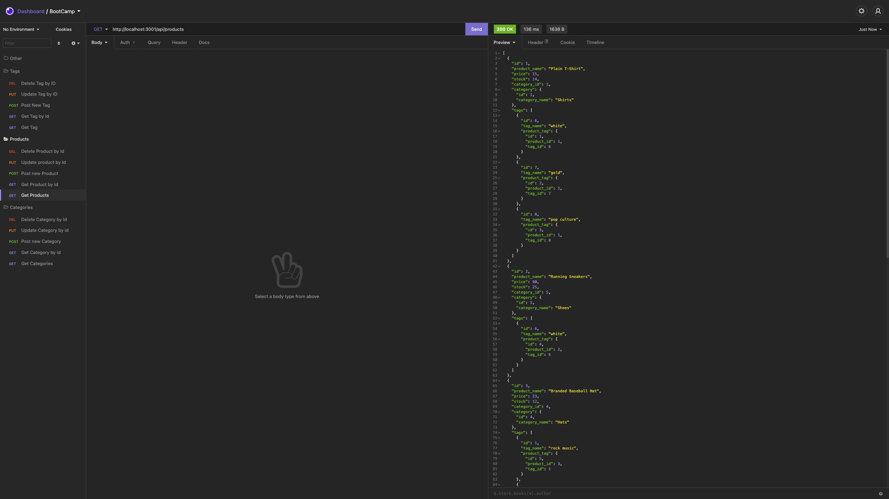
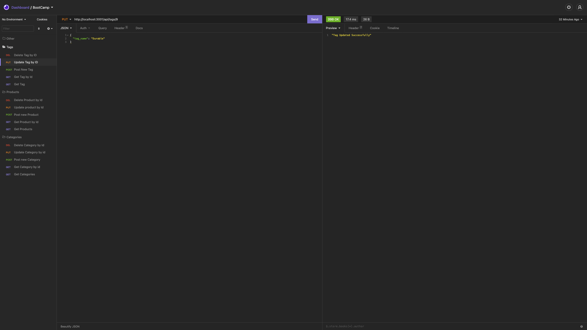

# E-Commerce-Back-End

---
[](https://opensource.org/licenses/MIT)

## Table of Contents:
- [Description](#description)
- [Installation](#installation)
- [Technologies](#technologies)
- [Usage](#usage)
- [Testing](#testing)
- [Screenshots](#screenshots)
- [Additional-Info](#additional-info)

---

## Description:

This application utilizes mysql, sequelize, and express to create a back-end portion of an E-commerce site. The user has the ability to find all the categories, products, and tags. Then they are able to change any of these, as well as, being able to create their own Categories, products, and tags. If the user no longer wants the informaiton they put in, the application will then allow them to delete them by selecting the IDs. 


---

## Technologies:
```
- Javascript
- Node
- Insomnia
- Sequelize 
- SQL
- Express
```

---

## Installation: 
```
Clone the repo and then run npm install in an integrated terminal. 
Run mysql -u root -p 
Source db/schema.sql
exit 
npm run seed
npm start

Installion Video Walkthrough: [Install-Walkthrough](https://drive.google.com/file/d/1rVZegp0be0B3s8uu7HsO0g18xG37h6Vo/view)
``` 

---

## Usage: 

This application can be used to Add, change, and delete categories, products, and tags. The user can add their own products and information to have their own E-commerce back-end portion of their online store. 


---

## Testing:

This back-end application has been internally tested by the creator. Screenshots of the application running in Insomnia are below. 

---


## Screenshots:

### Category Routes:


- Category Video Walkthrough: [Category-Walkthrough](https://drive.google.com/file/d/1A3EnhvvBI_0RD0ggtO9P_mRvTp97itYz/view)

### Product Routes:




- Product Video Walkthrough: [Product-Walkthrough](https://drive.google.com/file/d/1xAQLuDGmnJXNFoOIzEx-g771OvAqxj9u/view)

### Tag Routes:





- Tag Video Walkthrough: [Tag-Walkthrough](https://drive.google.com/file/d/18dZjG0qw3HWeFsSkA6YFayboeC0W0LwA/view)


---

## Additional Info:
- Github: [bvanburenwx](https://github.com/bvanburenwx)
- Email: bvanburenwx@gmail.com